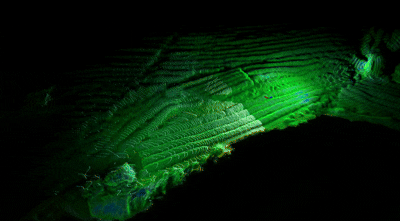
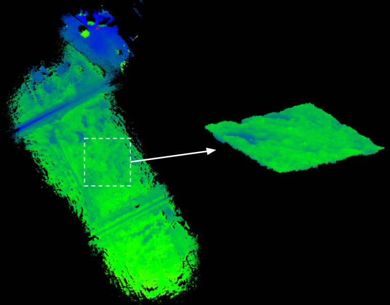
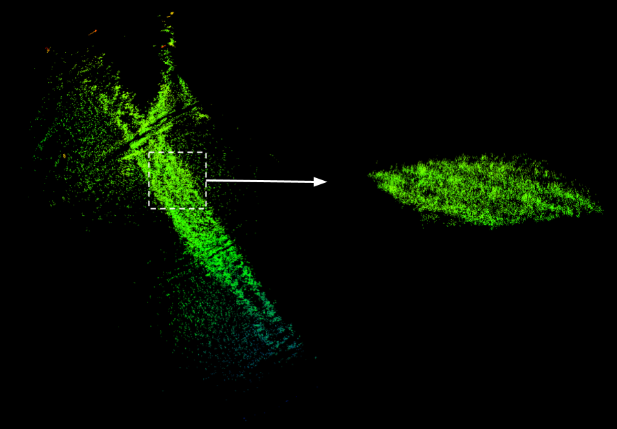
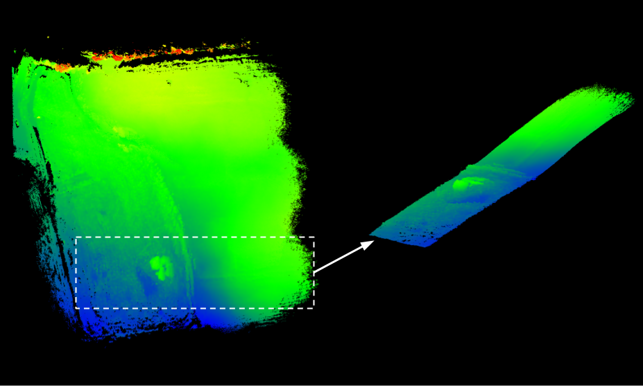
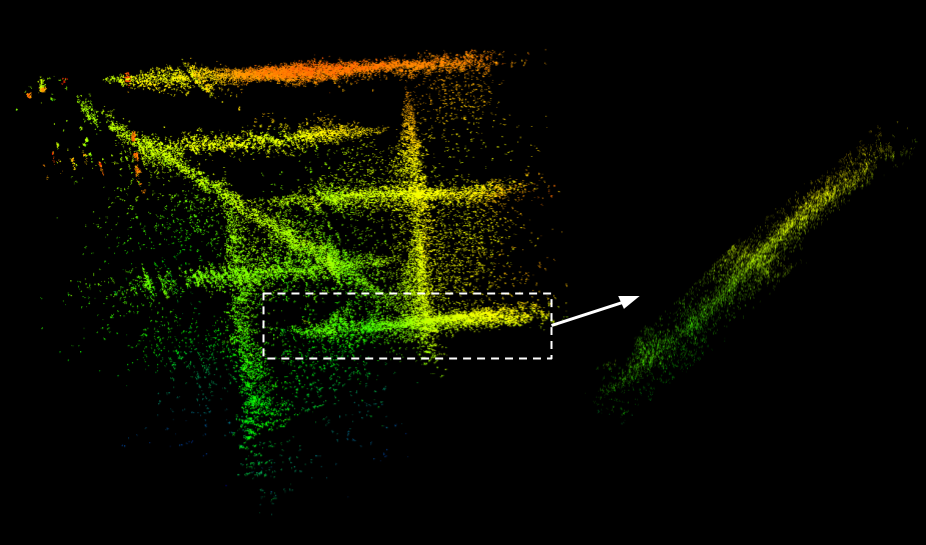
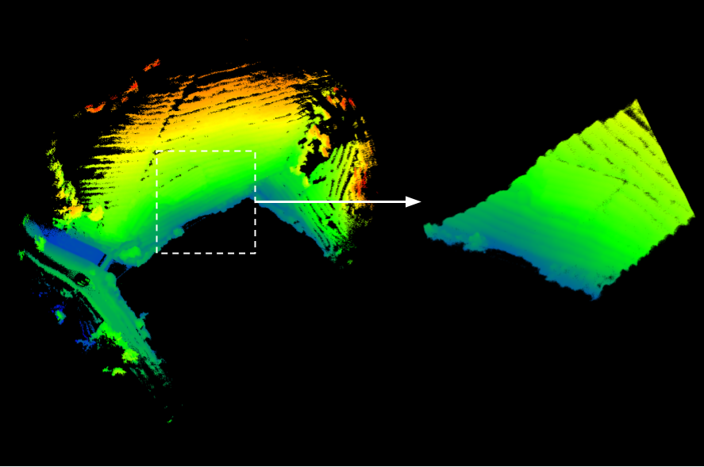
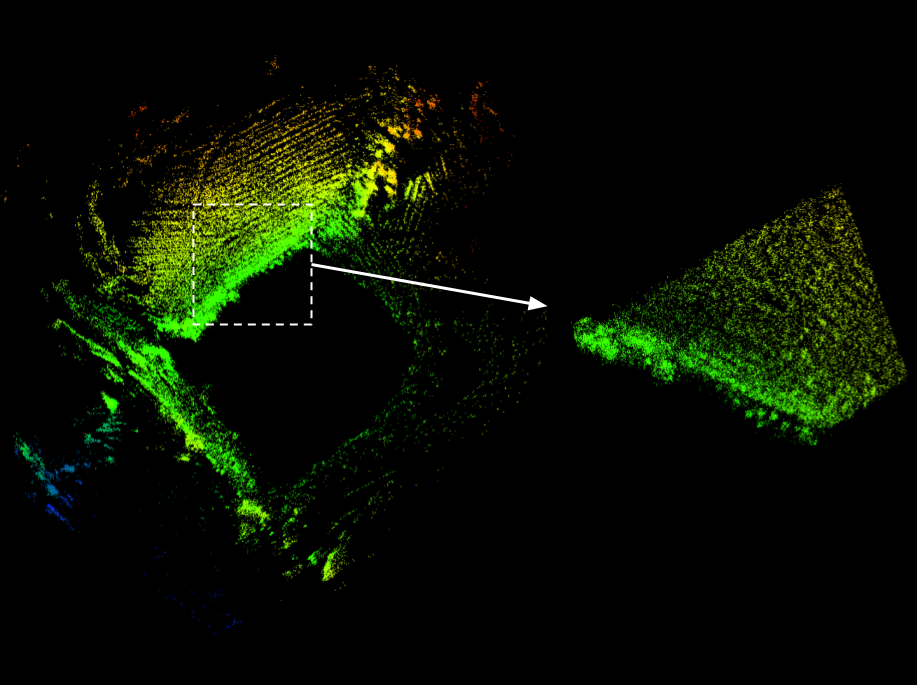

# AgriLiRa4D: A Multi-Sensor UAV Dataset for Robust SLAM in Challenging Agricultural Fields

<div align="left">
    
    
    
    
    
    
    
    
    
    
    
    
    
    
    
    
    
    
    
    
    
    
    
</div>

[[Website]](https://zhan994.github.io/AgriLiRa4D/)
[[Paper]](https://arxiv.org/abs/2512.01753) 
[[Hugging Face]](https://huggingface.co/datasets/zhan994/AgriLiRa4D)


## Overview
**AgriLiRa4D is a novel multi-modal dataset specifically developed for agricultural UAV SLAM research, incorporating LiDAR, 4D Radar, and IMU measurements collected using an agricultural UAV platform. Our dataset features high-precision ground truth trajectories obtained from a Fiber Optic Inertial Navigation System (FINS) module with a built-in Real-Time Kinematic (RTK) receiver (FINS_RTK), ensuring centimeter-level position accuracy and high-fidelity orientation references. This work aims to advance the development of robust SLAM systems tailored for agricultural autonomous operations.**

**Flat Farmland**

  


**Hilly Farmland**

  


**Terraced Farmland**

  


## News

- **Dec. 6, 2025** - [Dataset](https://huggingface.co/datasets/zhan994/AgriLiRa4D) upload is complete, and the [project page](https://zhan994.github.io/AgriLiRa4D/) as well as the [preprint paper](https://arxiv.org/abs/2512.01753) are now accessible.


## Mapping Results

| Scene                 | LiDAR                    | 4D Radar                 |
| --------------------- | ------------------------ | ------------------------ |
| **Flat Farmland**     |  |  |
| **Hilly Farmland**    |  |  |
| **Terraced Farmland** |  |  |


## Quick Start

**The dataset can be downloaded from [Hugging Face](https://huggingface.co/datasets/zhan994/AgriLiRa4D), while the calibration and ground-truth files are available in the [dataset folder](https://github.com/zhan994/AgriLiRa4D/tree/main/dataset).**

The raw measurements are available both as ROS 1 bags and in a documented,
ROS-independent representation. LiDAR and 4D Radar scans use timestamp-indexed
ASCII PCD files, while IMU and FINS-RTK measurements use CSV. See the
[open-format specification and conversion instructions](HUMAN_READABLE_FORMAT.md).

The 33 sequences of our dataset were collected across three representative farmland terrains—flat plains, hilly regions, and mountainous terraces—located in Nanjing, China. The dataset is organized into six sequence groups based on terrain type and scanning mode (*boundary* or *coverage*), namely *NJFlatB*, *NJFlatC*, *NJHillB*, *NJHillC*, *NJTerrB*, and *NJTerrC*.

For all sequences except *NJTerrB* and *NJTerrC*, the UAV flew at a constant altitude with respect to the take-off point. In contrast, for the mountainous-terrain sequences *NJTerrB* and *NJTerrC*, the UAV maintained a fixed height Above Ground Level (AGL) to ensure flight safety and stable sensor coverage over rapidly varying elevation. Multiple combinations of flight altitudes and speeds were employed to introduce different levels of SLAM difficulty. Each sequence additionally begins with a short stationary or hovering segment to facilitate IMU initialization.


| Scene                 | Sequence  | Scanning Mode | Altitude (m) | Speed (m/s) | Path Length (m) |
| :---------------------: | :---------: | :-------------: | :------------: | :-----------: | :---------------: |
| **Flat Farmland**     | NJFlatB01 | boundary      | 5            | 3           | 434.77          |
|                       | NJFlatB02 | boundary      | 5            | 8           | 464.21          |
|                       | NJFlatB03 | boundary      | 10           | 3           | 456.32          |
|                       | NJFlatB04 | boundary      | 10           | 8           | 462.18          |
|                       | NJFlatB05 | boundary      | 15           | 3           | 465.89          |
|                       | NJFlatB06 | boundary      | 15           | 8           | 454.21          |
|                       | NJFlatC01 | coverage      | 5            | 8           | 805.65          |
|                       | NJFlatC02 | coverage      | 10           | 3           | 801.17          |
|                       | NJFlatC03 | coverage      | 10           | 8           | 798.96          |
|                       | NJFlatC04 | coverage      | 15           | 3           | 822.23          |
| **Hilly Farmland**    | NJHillB01 | boundary      | 8            | 3           | 490.61          |
|                       | NJHillB02 | boundary      | 8            | 8           | 493.07          |
|                       | NJHillB03 | boundary      | 13           | 3           | 480.98          |
|                       | NJHillB04 | boundary      | 13           | 8           | 484.60          |
|                       | NJHillB05 | boundary      | 18           | 3           | 483.84          |
|                       | NJHillB06 | boundary      | 18           | 8           | 488.41          |
|                       | NJHillC01 | coverage      | 8            | 3           | 776.47          |
|                       | NJHillC02 | coverage      | 8            | 8           | 783.31          |
|                       | NJHillC03 | coverage      | 13           | 3           | 761.55          |
|                       | NJHillC04 | coverage      | 13           | 8           | 768.14          |
|                       | NJHillC05 | coverage      | 18           | 3           | 756.07          |
|                       | NJHillC06 | coverage      | 18           | 8           | 769.94          |
| **Terraced Farmland** | NJTerrB01 | boundary      | 3            | 3           | 204.91          |
|                       | NJTerrB02 | boundary      | 6            | 3           | 207.21          |
|                       | NJTerrB03 | boundary      | 6            | 6           | 209.71          |
|                       | NJTerrB04 | boundary      | 9            | 3           | 211.95          |
|                       | NJTerrB05 | boundary      | 9            | 6           | 215.72          |
|                       | NJTerrC01 | coverage      | 3            | 3           | 311.23          |
|                       | NJTerrC02 | coverage      | 3            | 6           | 307.53          |
|                       | NJTerrC03 | coverage      | 6            | 3           | 311.24          |
|                       | NJTerrC04 | coverage      | 6            | 6           | 300.84          |
|                       | NJTerrC05 | coverage      | 9            | 3           | 313.64          |
|                       | NJTerrC06 | coverage      | 9            | 6           | 317.48          |

The original Radar-LiDAR-Inertial sensor data is provided in ROS bag format, with
an equivalent ASCII PCD/CSV release for non-ROS users. Each bag contains the
following topics:

| Sensor   | Module           | Topic Name             | Message Type              | Rate (Hz) | Format |
| :--------: | :----------------: | :----------------------: | :-------------------------: | :---------: | :--------: |
| LiDAR    | Robosense Airy   | /rslidar_points        | sensor_msgs/PointCloud2   | 10        | ASCII PCD |
| IMU      | Built-in (LiDAR) | /rslidar_imu_data      | sensor_msgs/IMU           | 200       | CSV |
| 4D Radar | Mindcruise A1    | /radar_points          | sensor_msgs/PointCloud2   | 10        | ASCII PCD |
| FINS_RTK | TJ-FINS70D       | /aircraft_pose_enu     | geometry_msgs/PoseStamped | 100       | CSV |
|          |                  | /aircraft_pose_flu     | geometry_msgs/PoseStamped | 100       | CSV |
|          |                  | /aircraft_position_llh | sensor_msgs/NavSatFix     | 100       | CSV |

For `/rslidar_points`, pay attention to its point's timestamp: the per-point `timestamp` has a constant offset w.r.t. the message `header.stamp`, and its unit is **seconds (s)**.

For `/rslidar_points` and `/radar_points`, use custom PCL PointT type:

```cpp
namespace robosense {
struct EIGEN_ALIGN16 Point {
  PCL_ADD_POINT4D;
  float intensity;
  std::uint16_t ring = 0;
  double timestamp = 0;
  EIGEN_MAKE_ALIGNED_OPERATOR_NEW
};
} // namespace robosense
// clang-format off
POINT_CLOUD_REGISTER_POINT_STRUCT(robosense::Point,
    (float, x, x)
    (float, y, y)
    (float, z, z)
    (float, intensity, intensity)
    (std::uint16_t, ring, ring)
    (double, timestamp, timestamp)
)

// clang-format on
namespace txg_radar
{
struct EIGEN_ALIGN16 Point
{
  PCL_ADD_POINT4D;      // preferred way of adding a XYZ+padding
  float v_doppler_mps;  // Doppler velocity in m/s
  float snr_db;         // Signal-to-noise ratio in dB
  float rcs;            // Radar cross-section in m^2
  EIGEN_MAKE_ALIGNED_OPERATOR_NEW
};
}  // namespace txg_radar
// clang-format off
POINT_CLOUD_REGISTER_POINT_STRUCT(txg_radar::Point,
    (float, x, x)
    (float, y, y)
    (float, z, z)
    (float, v_doppler_mps, v_doppler_mps)
    (float, snr_db, snr_db)
    (float, rcs, rcs)
)

```

## Ground Truth

 

One of the three ground-truth representations (**FLU reference**) is provided using **TUM trajectory format** in this repository, along with the sensor extrinsic parameters of this acquisition device.

**Note: When performing ground-truth analysis, the estimated state must first be gravity-aligned, and then the IMU's odometry must be transformed to the body's odometry based on an FLU reference!!!**

Here is an example about how to convert gravity-aligned IMU's odometry obtained from a LIO/RIO/RLIO system into body's odometry based on an FLU reference.

```cpp
// FLU to gravity-aligned odom
M3D R_flu_odom;
R_flu_odom << 0, 1, 0, 
              -1, 0, 0, 
              0, 0, 1;
V3D t_flu_odom(0.0, 0.0, 0.0);

// body to imu
M3D R_airbody_imu;
R_airbody_imu << 0, 0, -1, 
                1, 0, 0, 
                0, -1, 0;
V3D t_airbody_imu(0.0, 0.0, 0.0);

// We can get `R_odom_imu` and `t_odom_imu` through LIO/RIO/RLIO (gravity-aligned)
M3D R_flu_imu = R_flu_odom * R_odom_imu;
V3D t_flu_imu = R_flu_odom * t_odom_imu + t_flu_odom;
M3D R_flu_body = R_flu_imu * R_airbody_imu.transpose();
V3D t_flu_body = t_flu_imu - R_flu_body * t_airbody_imu;
```

## Related Work

1. [FAST-LIO2: Fast Direct LiDAR-inertial Odometry](https://github.com/zhan994/FAST_LIO)
2. [Faster-LIO: Lightweight Tightly Coupled Lidar-inertial Odometry using Parallel Sparse Incremental Voxels](https://github.com/zhan994/faster-lio)
3. [EKF-RIO: Radar Inertial Odometry With Online Calibration](https://github.com/zhan994/rio)
4. [GaRLIO: Gravity enhanced Radar-LiDAR-Inertial Odometry](https://github.com/zhan994/GaRLIO)


## Citation

```
@misc{zhan2025agrilira4dmultisensoruavdataset,
      title={AgriLiRa4D: A Multi-Sensor UAV Dataset for Robust SLAM in Challenging Agricultural Fields}, 
      author={Zhihao Zhan and Yuhang Ming and Shaobin Li and Jie Yuan},
      year={2025},
      eprint={2512.01753},
      archivePrefix={arXiv},
      primaryClass={cs.RO},
      url={https://arxiv.org/abs/2512.01753}, 
}
```

<!--  -->
